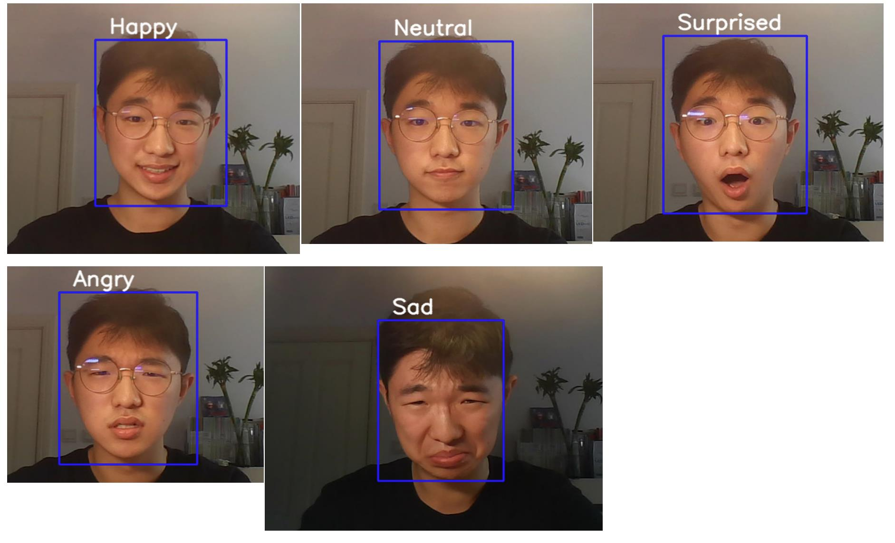

# Field 1的调试和结果

## 问题1 问题和修正

+ 首先遇到的问题是环境配置，我创建了python版本为3.6的环境，第一次安装tensorflow时没有标注gpu版本，这导致安装对应版本的CUDA也不能使用显卡进行模型训练。

​		解决方法是使用pip install命令时标注GPU版本

+ 配好环境才发现源文件中部分命令是旧版本keras中的。比如：

  keras.optimizers中没有Adam类，应该改为adam_v2
  
  下面这行才能正确使用。

  

  类似的还有如下图中的颜色分类需要修改为新版本的，不再赘述。

  

  

+ 训练好模型后使用时发现无法正确加载人脸检测器，因为源代码中的文件路径和我的不一样。直接修改为绝对路径以后就正常了。
  

## 问题2 训练结果、评价指标

+ 评价指标是以下四个：

  + loss：训练集上的误差
  + accuracy：训练集上的准确率
  + val_loss：测试集上的误差
  + val_accuracy：测试集上的准确率

+ 训练结果如下图所示：
  

  这是前50个Epoch。可以看出此时测试集上的loss已经趋于稳定。
  
  
  
  
  

​		保存权重继续训练时，虽然训练集的loss仍在下降，但测试集的loss不降反增，说明此时网络过拟合，则第一次训练的权重最合理。

## 问题3

识别我的表情的时候，disgust和fear是比较难检测到的，常常一闪而过，其他五种较为准确。

## 问题4（未完成）

## 问题5 对train.py的理解

+ 如何载入数据
  + 使用ImageDataGenerator将数据集归一化
    
  + 再使用ImageDataGenerator的train_datagen.flow_from_directory方法，将图片转化为单通道，并根据文件夹的内部分类，返回图片集的2D的one-hot编码标签。
    

+ 如何设计trainer
  下图是trainer构建部分：

  

  + 使用与独热编码对应的交叉熵损失函数categorical_crosstropy
  + 使用Adam优化器，学习率设为0.0001，每次递减1e-6
  + 评价函数为accuracy
  + 设置epoch为50，用全部数据50次来训练网络，
    steps_per_epoch为数据集个数/64，相当于设置了batchsize为64
    validation_step同理

+ 采用怎样的网络结构

  下图是模型构建部分：
  

  + 线性模型，将网络线性堆叠
  + 整体结构为2卷积层（ReLU激活）+1池化层 + 1dropout层+
                       2卷积层（ReLU激活）+1池化层 + 1dropout层 + 一维化(Flatten层)+
                       全连接层（ReLU激活）+ 1dropout层 + 全连接层（Softmax激活）
